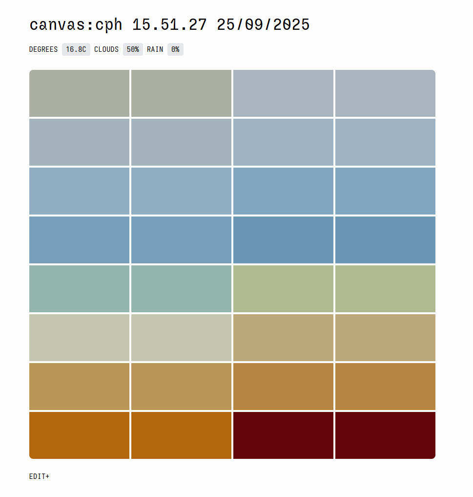

# 

An experimental visualization of the weather in Copenhagen, using data from DMI.
Try a demo here: https://richardlundquist.xyz/canvascph/ 

Data is from DMI. An API key can be found here: https://dmiapi.govcloud.dk/ 

Built using: React + TypeScript + Vite